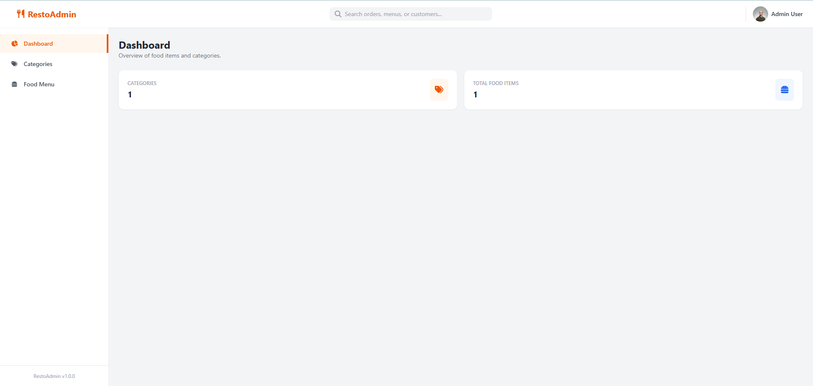
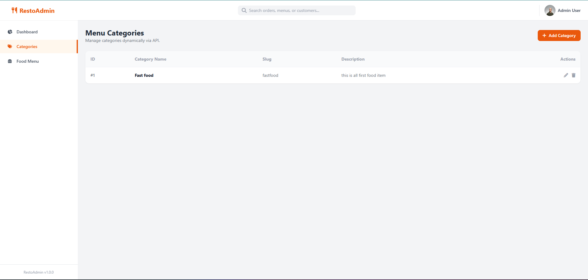
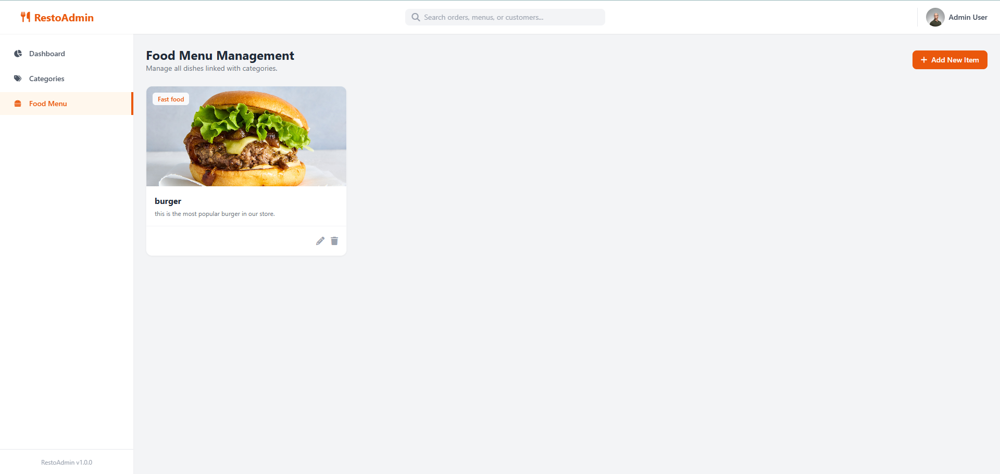

# 🍽️ RestoAdmin - Restaurant Management System

A full-stack Restaurant Management System Admin Panel built with Node.js, Express, MySQL, Tailwind CSS, and Vanilla JavaScript.

---

## 📸 Screenshots

### 1. Dashboard Overview
Central command center displaying real-time summary counts for categories and food items.

---

### 2. Category Management (CRUD)
Dynamic management interface to create, update, and delete menu categories with slug and status.

---

### 3. Food Menu Management
Interactive grid interface displaying all culinary offerings linked directly to their categories with instant edit and delete capabilities.

